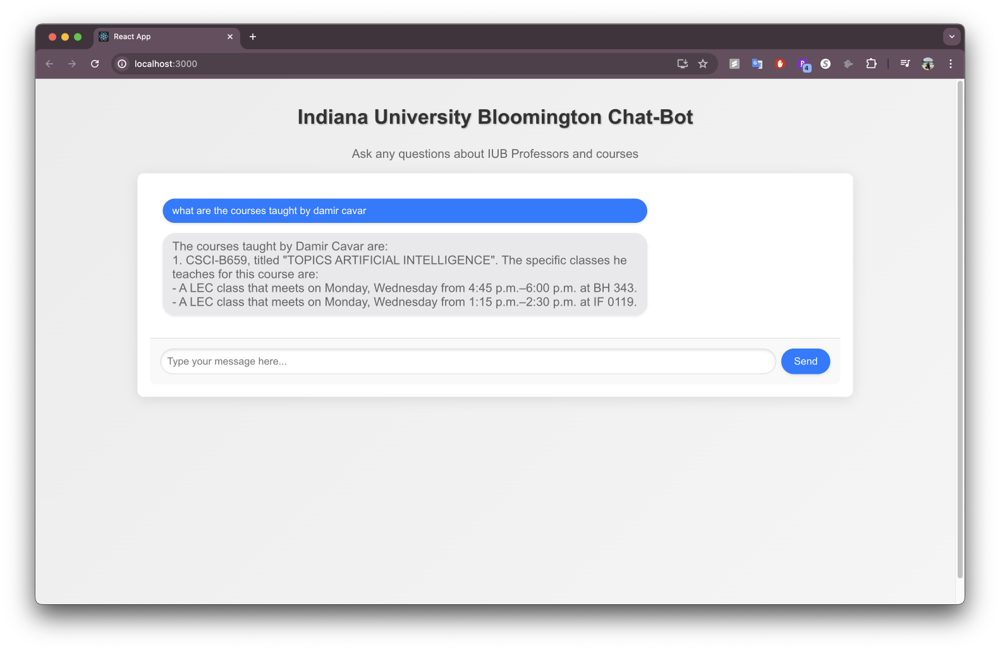

# Academic Coursework Planner Project



## Overview

The Academic Coursework Planner project aims to answer questions related to Indiana University Bloomington by integrating GPT (Generative Pre-trained Transformer) and Pinecone for efficient data querying and embedding. This project leverages several Python scripts and Jupyter notebooks to preprocess data, create embeddings, and expose a Flask API for interaction.

## File Descriptions

1. **app.py**
   - This is the main Flask API file where the endpoints are exposed for interacting with the embedded data and GPT model. It handles incoming requests and provides appropriate responses.

2. **course_text_creation.ipynb**
   - This Jupyter notebook is responsible for creating textual representations of the courses. It processes course data and prepares it for embedding creation.

3. **preprocess_prof.ipynb**
   - This notebook preprocesses professor data. It includes steps for handling shorthand notations of professor names by scraping and using a full list of professor names from another university's HTML file.

4. **scrapping_and_data_preprocessing.ipynb**
   - This notebook handles the scraping and preprocessing of course and professor data. It includes methods to clean and structure the data for embedding creation.

5. **testing_ai.ipynb**
   - This notebook is used for testing the AI model's performance. It includes code for querying the embeddings and evaluating the responses from the GPT model.

## Instructions to Run the Project

1. **Clone the Repository**

   ```bash
   git clone https://github.com/yourusername/academic-coursework-planner.git
   cd academic-coursework-planner
2. **Run the Jupyter Notebooks**
   - Open each notebook (`course_text_creation.ipynb`, `preprocess_prof.ipynb`, `testing_ai.ipynb`) and run the cells to preprocess data and create embeddings.

3. **Start the Flask API**

   ```bash
   python app.py

4. **Access the API**
   - The API will be available at `http://127.0.0.1:5001/`. You can send requests to this endpoint to get responses based on the embedded data and GPT model.
  
## Issues Faced and Solutions
1. **Shorthand Notation of Days**

   - Problem: Days of the week were represented in shorthand notation (e.g., "M", "T", "W").
   - Solution: Manually converted the shorthand notations to full forms using a dictionary. This ensured consistency in the data and improved embedding quality.

2. **Shorthand Notation of Professor Names**

   - Problem: Professor names were abbreviated, leading to difficulties in querying and matching data.
   - Solution: Scraped another university's HTML file that included the full names of all professors. This provided a comprehensive list to map and replace shorthand notations with full names, ensuring better data integrity and query accuracy.

By following these steps and considerations, the Academic Coursework Planner project efficiently handles data preprocessing, embedding creation, and querying, providing accurate and relevant responses to Indiana University Bloomington related queries.
